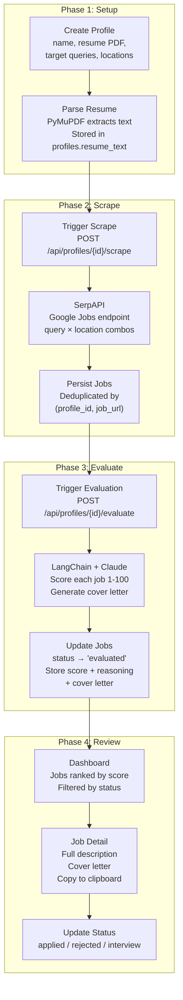

# End-to-End Flow

The full lifecycle from profile creation to actionable job matches.

## Flow Chart

```mermaid
flowchart TD
    subgraph "Phase 1: Setup"
        A["Create Profile\nname, resume PDF,\ntarget queries, locations"] --> B["Parse Resume\nPyMuPDF extracts text\nStored in profiles.resume_text"]
    end

    subgraph "Phase 2: Scrape"
        B --> C["Trigger Scrape\nPOST /api/profiles/{id}/scrape"]
        C --> D["SerpAPI\nGoogle Jobs endpoint\nquery × location combos"]
        D --> E["Persist Jobs\nDeduplicated by\n(profile_id, job_url)"]
    end

    subgraph "Phase 3: Evaluate"
        E --> F["Trigger Evaluation\nPOST /api/profiles/{id}/evaluate"]
        F --> G["LangChain + Claude\nScore each job 1-100\nGenerate cover letter"]
        G --> H["Update Jobs\nstatus → 'evaluated'\nStore score + reasoning\n+ cover letter"]
    end

    subgraph "Phase 4: Review"
        H --> I["Dashboard\nJobs ranked by score\nFiltered by status"]
        I --> J["Job Detail\nFull description\nCover letter\nCopy to clipboard"]
        J --> K["Update Status\napplied / rejected / interview"]
    end
```
