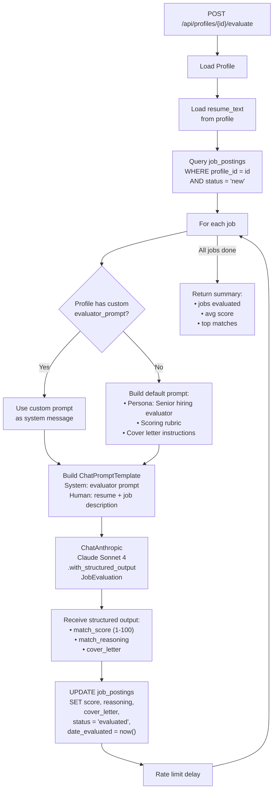

# Evaluation Pipeline

How unevaluated job postings get scored and matched against a profile's resume.
Implemented in `app/evaluator.py`.

## Flow Chart

## LangChain Components

| Component | Usage |
|-----------|-------|
| `ChatAnthropic` | LLM wrapper for Claude Sonnet 4 |
| `ChatPromptTemplate` | System + human message construction |
| `.with_structured_output()` | Enforces `JobEvaluation` Pydantic schema |
| Chain (`prompt \| model`) | Composes the pipeline |
