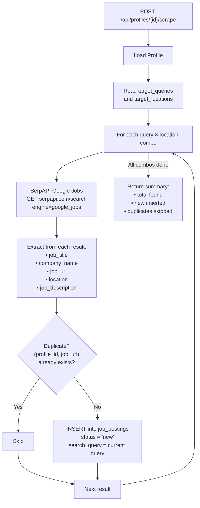

# Scraping Pipeline

How a profile's target queries become persisted job postings.
Implemented in `app/scraper.py`.

## Flow Chart

```mermaid
flowchart TD
    A["POST /api/profiles/{id}/scrape"] --> B["Load Profile"]
    B --> C["Read target_queries\nand target_locations"]

    C --> D["For each query × location combo"]

    D --> E["SerpAPI Google Jobs\nGET serpapi.com/search\nengine=google_jobs"]

    E --> F["Extract from each result:\n• job_title\n• company_name\n• job_url\n• location\n• job_description"]

    F --> G{"Duplicate?\n(profile_id, job_url)\nalready exists?"}

    G -->|Yes| H["Skip"]
    G -->|No| I["INSERT into job_postings\nstatus = 'new'\nsearch_query = current query"]

    H --> J["Next result"]
    I --> J
    J --> D

    D -->|All combos done| K["Return summary:\n• total found\n• new inserted\n• duplicates skipped"]
```
